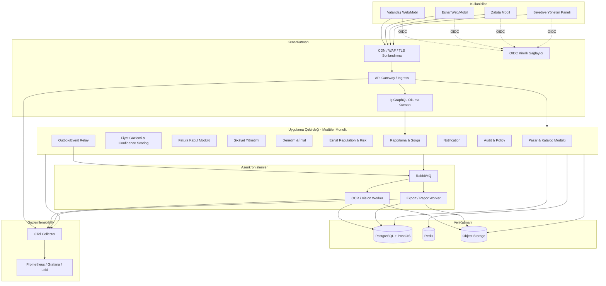
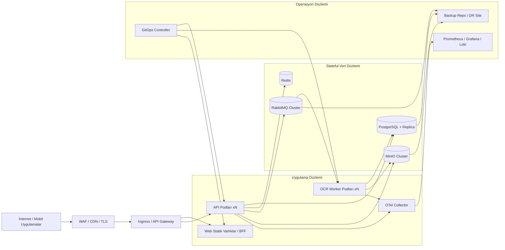

# Pazar Şaffaf İçin Katmanlı Yazılım Mimarisi ve Sistem Şartnamesi

## Yönetici özeti

Yüklenen kabul edilmiş proje raporuna göre **Pazar Şaffaf**, entity["organization","İnönü Üniversitesi","malatya state university"] bünyesinde kurgulanmış, entity["country","Türkiye","eurasian country"] genelindeki semt pazarları için fiyat şeffaflığı, dijital denetim, vatandaş bildirimi, yapay zekâ destekli fatura/OCR işleme, coğrafi analiz ve paydaş bazlı yönetim işlevlerini tek platformda birleştiren bir sistemdir. Mevcut raporda teknik omurga olarak Spring Boot tabanlı modüler monolit, React ve React Native istemciler, PostgreSQL + PostGIS, Redis, RabbitMQ, MinIO, Ollama ve Docker Compose zaten tanımlanmıştır. Bu nedenle bu rapor “sıfırdan teknoloji seçimi” değil, mevcut kabul edilmiş çözümü üretim düzeyinde kurumsallaştıran ve ölçeklendiren bir hedef mimari önerir. fileciteturn0file0

Bu proje için önerilen ana mimari karar, **çekirdeği modüler monolit bırakıp modül sınırlarını sertleştirmek**, yüksek gecikmeli işleri **ayrı worker** süreçlerine taşımak, kullanıcıya dönük trafiği **API-first** biçimde yönetmek ve veriyi **PostgreSQL/PostGIS merkezli tek doğruluk kaynağı** etrafında toplamak olmalıdır. Spring Modulith, Spring Boot üzerinde alan odaklı modüler yapıyı ve modüller arası olay tabanlı etkileşimi destekler; RabbitMQ quorum queue yaklaşımı çoğaltılmış ve yüksek erişilebilir mesaj kuyruğu sunar; PostgreSQL declarative partitioning ile büyük zaman serilerini yönetebilir ve PostGIS de mekânsal sorgu ile indekslemeyi yerel olarak sağlar. citeturn12search7turn12search23turn3search0turn3search20turn1search2turn1search7

Varsayılan dağıtım tercihi tam yönetilen bulut değil, **hibrit / on-prem ağırlıklı** olmalıdır. Bunun nedeni; vatandaş şikâyetleri, görsel deliller, fatura belgeleri ve denetim verilerinin kişisel veri içerebilmesi; ayrıca üretken yapay zekâ ve KVKK rehberlerinin veri minimizasyonu, yurt dışı aktarım kontrolü, saklama-imha ve *privacy by design* ilkelerini açık biçimde vurgulamasıdır. Dolayısıyla OCR/vision hattı, kanıt görselleri ve denetim belgeleri tercihen kurum içinde ya da veri egemenliği net tanımlanmış bir ortamda işlenmeli; bulut katmanı ise CDN/edge, ikincil felaket kurtarma ve opsiyonel yönetilen servisler için değerlendirilmelidir. citeturn16view1turn14search11turn14search5turn14search12turn2search3turn13search0turn13search16

## Bağlam, varsayımlar ve mimari hedefler

| Başlık | Bu rapordaki kabul | Mimariye etkisi |
|---|---|---|
| Proje bağlamı | Kullanıcı isteminde alan “belirtilmemiş” dense de yüklenen kabul edilmiş rapor semt pazarı fiyat şeffaflığı ve denetim alanını açıkça tanımlıyor | Mimarinin bounded context’leri pazar, tezgâh, esnaf, fiyat gözlemi, fatura/OCR, şikâyet ve denetim etrafında kuruldu |
| Hedef platformlar | İstemde belirtilmemiş; rapor ise web ve mobil istemcileri tanımlıyor | Mimari web, mobil, yönetim paneli ve API-first olacak şekilde; ama sunum katmanı modüler kalacak biçimde tasarlandı |
| Bütçe | Belirtilmemiş | Kesin lisans/fiyat değil, kaynak profilleri ve maliyet sürücüleri verildi |
| Takvim | Belirtilmemiş | Aşamalı geçiş ve kademeli rollout stratejisi önerildi |
| Ölçeklenme ekseni | Belediye bazlı çok kiracılık olası | `tenant_id` / `municipality_id` alanı tüm çekirdek kayıtlarda zorunlu olmalı |
| Uyum önceliği | KVKK-first | Veri sınıflandırması, silme-anonimleştirme ve privacy-by-design varsayılan olmalı |

Yüklenen rapor, mevcut MVP’nin zaten vatandaş, esnaf, zabıta ve belediye yöneticisi gibi farklı roller için işlev tasarladığını; OCR, crowdsourcing, güvenilirlik skoru, coğrafi analiz, Redis, RabbitMQ, MinIO ve Docker Compose kullandığını belirtiyor. Bu da hedef mimarinin “tek belediye pilotu → bölgesel Kubernetes → ulusal yayılım” çizgisinde düşünülmesini doğal kılıyor. fileciteturn0file0

Bu çerçevede mimari hedefler şunlardır: çekirdek iş kurallarında yüksek tutarlılık; OCR ve analitik gibi pahalı işlerde asenkron işleme; belediye bazlı tenant izolasyonu; nesne/delil verilerinde değişmezlik ve denetlenebilirlik; gözlemlenebilirlik varsayılanı; güvenlikte OIDC/JWT, nesne düzeyi yetkilendirme ve oran sınırlama; veride saklama-imha ve anonimleştirme yönetilebilirliği. Bu yönelim hem kabul edilmiş proje raporundaki gereksinimlerle hem de modüler Spring yaklaşımı, API güvenliği ve KVKK rehberlerindeki veri minimizasyonu ile privacy-by-design ilkeleriyle uyumludur. fileciteturn0file0 citeturn12search7turn7search0turn7search1turn14search11turn16view1

## Katmanlı hedef mimari

Önerilen hedef mimari, **çekirdek iş yeteneklerini modüler monolit içinde** tutar; ancak OCR/vision, bildirim ve toplu raporlama gibi gecikmeye toleranslı iş yüklerini ayrı worker’lara çıkarır. Bu yaklaşım, mevcut projenin modüler monolit yönünü korurken, Spring Modulith ile modül sınırlarını doğrulanabilir hâle getirir; PostgreSQL/PostGIS’i merkezî kayıt sistemi olarak tutar; RabbitMQ ile güvenli geri deneme ve DLQ senaryolarını işler; Redis ile cache/rate-limit sağlar; MinIO ile kanıt/fatura nesnelerini saklar. fileciteturn0file0 citeturn12search7turn12search23turn1search2turn1search7turn3search0turn13search3turn13search15turn13search10turn2search14turn13search9



Bu ayrımda yazma trafiği REST ağırlıklı sistem API’lerine gider; yönetim paneli gibi kompozit okuma ekranları için ek bir GraphQL okuma katmanı kullanılabilir; tüm servisler telemetriyi OpenTelemetry Collector’a yollar. Spring Boot gözlemlenebilirlik desteği log/metric/trace üçlüsünü Micrometer Observation ile üretir; OpenTelemetry Collector veriyi zenginleştirebilir veya kişisel bilgi maskelemesi uygulayabilir; Prometheus ve Alertmanager alarmları yönetir; Loki etiket tabanlı düşük maliyetli loglama sağlar. citeturn0search0turn0search7turn4search7turn4search16turn3search2turn3search6turn3search11

| Katman | Ana bileşenler | Sorumluluk |
|---|---|---|
| Sunum | Vatandaş uygulaması, esnaf portalı, zabıta mobil istemcisi, belediye paneli, admin konsolu | Kimlik doğrulama başlatma, fiyat görüntüleme, bildirim/fotoğraf yükleme, denetim formu, rapor ekranları |
| API / Gateway | Ingress/API gateway, OIDC callback uçları, istek doğrulama, rate limit, WAF kuralları, GraphQL okuma katmanı | Kenar güvenliği, throttling, tenant bağlamı, versiyonlama, dış entegrasyon girişleri |
| Uygulama / Service | Fiyat kabul servisi, confidence scoring, fatura kabul, OCR orkestrasyonu, şikâyet workflow’u, denetim servisi, reputation/risk, bildirim, raporlama | Use-case orkestrasyonu, transaction sınırları, olay yayınlama, iş akışları |
| Domain | Pazar, tezgâh, esnaf, ürün, fiyat gözlemi, fatura, OCR işi, şikâyet, ihlal, reputation olayı, risk skoru | İş kuralları, alan tutarlılığı, nesne düzeyi yetki kuralları |
| Veri kalıcılığı | PostgreSQL, PostGIS, Redis, RabbitMQ, object storage, outbox tablosu, audit kayıtları | Transactional gerçek kaynak, coğrafi sorgu, cache, kuyruk, delil depolama, denetim izi |
| Altyapı | Docker imajları, Kubernetes/Compose, storage class, gizli yönetimi, CI/CD, gözlemlenebilirlik yığını, yedekleme | Dağıtım, ölçekleme, ağ politikası, sertifika, yedekleme ve DR |
| Çapraz kesenler | Kimlik/yetki, audit, validation, idempotency, correlation-id, feature flag, tenant izolasyonu, veri sınıflandırması | Tüm katmanlarda tutarlılık, uyum, güvenlik ve işletilebilirlik |

Çekirdek modüller arası iletişim, mümkün olduğunca senkron doğrudan bağımlılık yerine olay yayını ile yapılmalıdır; Spring Modulith bunu özellikle teşvik eder. Fiyat tarihçesi için `observed_at` alanına göre ayrılmış PostgreSQL partition’ları; yakın pazar/saha analizi için PostGIS GiST indeksleri; rate-limit ve sıcak veri için Redis TTL; OCR retry ve hata izolasyonu için RabbitMQ quorum + DLX + TTL birleşimi en uygun örüntüdür. citeturn12search23turn1search2turn1search7turn2search12turn13search10turn3search0turn13search3turn13search15

## Katman bazında teknoloji seçenekleri

Aşağıdaki karşılaştırma, kabul edilmiş proje raporundaki mevcut seçimi üretim düzeyine taşımak için hazırlanmıştır. Karşılaştırma resmi dokümantasyonlara dayanır: React ve React Native sunum katmanını, Vite web varlık üretimini, Spring Boot ile Spring Security uygulama katmanını, PostgreSQL/PostGIS veri tarafını, Redis ve RabbitMQ performans/asenkron altyapıyı, MinIO nesne depolamayı, Ollama ve Tesseract belge işleme alternatiflerini, Kubernetes/Docker çalışma ortamını ve yönetilen bulut hizmetleri de bulut-yerel alternatifi temsil eder. citeturn1search0turn1search12turn12search0turn0search7turn8search5turn1search2turn1search7turn13search10turn3search0turn2search14turn2search3turn8search4turn9search10turn3search1turn5search0turn5search1turn18search4turn18search1

| Katman | Bulut-yerel alternatif | On-prem alternatif | Artılar | Eksiler | Önerilen yığın |
|---|---|---|---|---|---|
| Sunum | React + Vite web varlıkları statik hosting/CDN üzerinde; mobil istemci mağaza dağıtımı | Aynı React + Vite + React Native kod tabanı, kurum içi Nginx/Ingress arkasında yayın | Tek kod tabanı, hızlı teslimat, CDN ile düşük gecikme | Egress ve edge bağımlılığı; kamusal metaveri kontrolü gerekir | **React + TypeScript + Vite**, **React Native**; web varlıkları mümkünse TR’ye yakın edge veya kurum içi |
| API / Gateway | Yönetilen API gateway + WAF + throttling + request validation | Kubernetes Ingress + gateway katmanı + WAF kuralları | Yönetilen modelde düşük operasyon; on-prem’de tam kontrol | Yönetilen gateway bulutta veri yolu bağımlılığı yaratır; on-prem operasyon yükü artar | Public edge’de **gateway + OIDC + rate limit**; GraphQL yalnızca okuma kompozisyonu için |
| Uygulama / Service | Yönetilen Kubernetes üzerinde container workload’lar; managed OCR/LLM isteğe bağlı | Kubernetes veya ilk aşamada Docker Compose; OCR worker ayrı deployment | Yatay ölçek, self-healing, rollout kolaylığı | Düşük trafik pilotta K8s aşırı karmaşık olabilir | **Spring Boot 3.x + Spring Modulith + ayrı OCR worker** |
| Domain | Aynı alan modeli; ileride mikroservis çıkarımına hazır | Aynı alan modeli | Kod tabanı tek, tutarlılık yüksek | Sınırlar iyi yönetilmezse “büyük monolit” riski | **Bounded context’ler + iç olaylar + modül sınır testleri** |
| Veri kalıcılığı | Yönetilen PostgreSQL/PostGIS + yönetilen Redis + yönetilen mesaj broker + object storage + opsiyonel managed OCR | PostgreSQL/PostGIS + Redis + RabbitMQ quorum + MinIO + Ollama/Tesseract | Yönetilen model operasyonu azaltır; on-prem model veri egemenliği sağlar | Yönetilen OCR/LLM yurt dışı aktarım ve gizlilik incelemesi ister; on-prem’de işletim sorumluluğu yüksektir | **On-prem/hybrid veri düzlemi**; özellikle OCR, fatura ve delil dosyaları kurum içinde |
| Altyapı | Managed Kubernetes, VPC, load balancer, managed secrets/monitoring | RKE2/kubeadm/k3s sınıfı K8s, CSI/NAS/SAN, iç ağ segmentasyonu | Managed bulut hızlı kurulur; on-prem ağ ve veri üzerinde tam kontrol verir | On-prem’de operasyon ekibi gerekir | Pilotta **Compose**, prod’da **Kubernetes** |
| Çapraz kesenler | Yönetilen OIDC ve gözlemlenebilirlik servisleri | Keycloak + OTel + Prometheus + Grafana + Loki + Argo CD/Rollouts | Açık kaynakta lisans maliyeti düşük ve taşınabilir | Entegrasyon ve işletim disiplini gerekir | **OIDC/JWT + OTel + Prometheus/Grafana/Loki + GitOps** |

Bu proje için dengeli sonuç, **hibrit / on-prem ağırlıklı mimaridir**: istemci katmanı aynı kalır; public edge’de gateway ve TLS sonlandırma bulunur; uygulama çekirdeği containerized Spring Boot olarak çalışır; veri düzlemi ve OCR hattı kurum içinde konuşlanır; isterse sadece edge/CDN ve sekonder DR buluta açılır. Bu seçim, kabul edilmiş projenin yerel AI yaklaşımı ve Docker Compose pilot kurgusuyla da uyumludur; ölçek büyüdüğünde Kubernetes’e geçiş doğal yoldur. fileciteturn0file0 citeturn12search1turn3search9turn9search10turn8search7turn8search2turn16view1

## Veri modeli, entegrasyonlar ve API sözleşmeleri

Veri modelinde temel ilke, **operasyonel doğruluk için ilişkisel merkez**, **yüksek hacimli nesneler için object storage**, **geçici hızlandırma için in-memory cache**, **asenkron iş akışları için durable queue** kullanmaktır. Kabul edilmiş proje raporundaki fiyat gözlemi, fatura/OCR, reputation, şikâyet ve coğrafi analiz ihtiyaçları bu dağılımı doğrudan destekler; PostgreSQL partitioning uzun dönem fiyat serileri için; PostGIS ise pazar konumu, yakınlık ve bölgesel karşılaştırma için uygundur. fileciteturn0file0 citeturn1search2turn1search7turn2search14turn13search9turn3search0turn13search10

| Varlık / koleksiyon | Birincil saklama | Temel alanlar | Teknik not |
|---|---|---|---|
| `municipality` | PostgreSQL | `id`, `name`, `status`, `policy_profile` | Tenant kökü |
| `market` | PostgreSQL + PostGIS | `municipality_id`, `geom`, `schedule`, `density_profile` | `geom` için GiST indeks |
| `vendor` | PostgreSQL | `market_id`, `stall_id`, `reputation_score`, `status` | Reputation olaylardan türetilmeli |
| `product` / `product_alias` | PostgreSQL | `canonical_name`, `category`, `unit`, `aliases` | OCR eşleştirme için alias tablosu |
| `price_observation` | PostgreSQL | `tenant_id`, `market_id`, `vendor_id`, `product_id`, `price`, `currency`, `confidence`, `source`, `observed_at` | Aylık range partition; `(market_id, product_id, observed_at desc)` indeks |
| `invoice` / `invoice_line` | PostgreSQL + Object Storage | `object_key`, `checksum`, `status`, `ocr_job_id`, satır bazlı ürün/fiyat/miktar | Ham dosya object storage’da; normalize satırlar PostgreSQL’de |
| `evidence_object` | Object Storage | `bucket`, `key`, `sha256`, `retention_until`, `version_id` | Bucket versioning + object lock önerilir |
| `ocr_job` | PostgreSQL + RabbitMQ | `submitted_at`, `started_at`, `completed_at`, `status`, `raw_model_output` | `raw_model_output` JSONB |
| `complaint` / `inspection` / `violation` | PostgreSQL | iş akışı durumları, atama, çözüm zamanı, kanıt referansları | SLA ve denetim izi kritik |
| `reputation_event` | PostgreSQL | `vendor_id`, `event_type`, `delta`, `reason`, `authorized_by` | Append-only tutulmalı |
| `outbox_event` | PostgreSQL | `aggregate_type`, `aggregate_id`, `event_type`, `payload`, `published_at` | Güvenilir event publish için |
| `audit_log` | PostgreSQL + Object Storage | `actor`, `action`, `resource`, `before_hash`, `after_hash`, `trace_id` | Periyodik immutable export önerilir |

Redis, kısa ömürlü sorgu hızlandırma, coğrafi yakın pazar listeleri, rate-limit sayaçları ve oturum/nonce verileri için kullanılmalıdır. Object storage üzerinde bucket versioning, retention ve şifreleme açık olmalıdır; fatura ve delil nesneleri için checksum doğrulaması zorunlu tutulmalıdır. RabbitMQ tarafında OCR, bildirim ve dış sistem entegrasyonları için ayrı kuyruklar; retry, DLX ve TTL politikaları ile izole edilmelidir. citeturn13search10turn13search22turn13search0turn13search9turn13search1turn13search3turn13search15

Entegrasyon deseninde yazma tarafı için **REST**, yönetim paneli ve analitik ekranlar için **GraphQL okuma katmanı**, pahalı ve gecikmeli görevler için **mesaj kuyruğu**, belediye ERP veya dış denetim yazılımları için **signed webhook / client credentials** uygun olur. REST uçlarında `Idempotency-Key`, `Correlation-Id` ve `Tenant-Id`; GraphQL’de ise yönetim paneli odaklı tipli sorgu yüzeyi ve rol bazlı alan yetkilendirmesi önerilir. Nesne düzeyi yetkilendirme denetimi, özellikle API güvenliği açısından zorunludur. citeturn4search2turn4search15turn4search21turn7search0turn7search2turn8search5

```http
POST /v1/invoices
Authorization: Bearer <access_token>
Idempotency-Key: 0f3f6d3c-58b2-4bdb-8d5d-1c188d3d42a6
Content-Type: application/json

{
  "tenantId": "MUNI-44",
  "vendorId": "VND-1042",
  "marketId": "MKT-44-07",
  "objectKey": "invoices/2026/04/28/6d8d-fatura.jpg",
  "documentType": "WHOLESALE_INVOICE"
}
```

```http
HTTP/1.1 202 Accepted
Content-Type: application/json

{
  "jobId": "OCR-20260428-000912",
  "status": "PENDING",
  "pollUrl": "/v1/ocr-jobs/OCR-20260428-000912"
}
```

```http
GET /v1/markets/MKT-44-07/prices?productId=PRD-TOMATO&publishedOnly=true
Authorization: Bearer <access_token>
```

```http
HTTP/1.1 200 OK
Content-Type: application/json

{
  "marketId": "MKT-44-07",
  "productId": "PRD-TOMATO",
  "medianPrice": 31.5,
  "minPrice": 28.0,
  "maxPrice": 35.0,
  "confidenceBand": "HIGH",
  "samples": [
    {
      "observationId": "OBS-9912",
      "vendorId": "VND-1010",
      "price": 30.0,
      "confidence": 82,
      "observedAt": "2026-04-28T08:55:12+03:00"
    }
  ]
}
```

Bu REST sözleşmesi, kullanıcı etkileşimlerini hızlı geri döndürüp pahalı OCR işini asenkronlaştırır; ayrıca OWASP’ın giriş doğrulama, 429 oran sınırlama ve hata detaylarını sızdırmama yaklaşımıyla uyumludur. citeturn7search2turn3search0turn13search3turn13search15

```graphql
type Query {
  market(id: ID!): Market
  markets(near: GeoPointInput, radiusMeters: Int, productId: ID): [Market!]!
  vendor(id: ID!): Vendor
  priceObservations(filter: PriceObservationFilter!): [PriceObservation!]!
  complaint(id: ID!): Complaint
  ocrJob(id: ID!): OCRJob
}

type Mutation {
  submitPriceObservation(input: SubmitPriceObservationInput!): SubmissionResult!
  createComplaint(input: CreateComplaintInput!): Complaint!
  uploadInvoice(input: UploadInvoiceInput!): OCRJob!
  assignInspection(input: AssignInspectionInput!): Inspection!
}

type Subscription {
  ocrJobUpdated(jobId: ID!): OCRJob!
}

type Market {
  id: ID!
  name: String!
  location: GeoPoint!
  currentPrices(productId: ID!): [PriceSummary!]!
}

type Vendor {
  id: ID!
  displayName: String!
  reputationScore: Int!
  stallCode: String
}

type PriceObservation {
  id: ID!
  vendor: Vendor!
  productId: ID!
  price: Float!
  confidence: Int!
  source: ObservationSource!
  observedAt: DateTime!
}
```

GraphQL şeması, özellikle yönetim panelinde tek ekranda pazar, ürün, esnaf ve güvenilirlik verisini tipli ve öngörülebilir biçimde toplamak için yararlıdır; ancak yazma tarafının ve dış entegrasyonların ana hattı REST kalmalıdır. GraphQL’nin güçlü tipli şema ve introspection modeli, iç kullanım için avantaj sağlar; dışa açık kullanımda rol-temelli alan kısıtları zorunludur. citeturn4search2turn4search15turn4search18

| Kimlik ve yetkilendirme akışı | Uygun kullanıcı tipi | Öneri |
|---|---|---|
| Authorization Code + PKCE | Vatandaş, esnaf, zabıta mobil ve web | Varsayılan oturum açma akışı |
| Authorization Code + PKCE + MFA | Belediye yöneticisi, sistem yöneticisi | Yönetim paneli ve yüksek ayrıcalıklı işlemler için zorunlu |
| Client Credentials | Worker’lar, iç servisler, dış kurumsal entegrasyonlar | Servisler arası çağrılar için |
| JWT Resource Server doğrulaması | Tüm API çağrıları | Gateway ve uygulama katmanında çift kontrol |
| Nesne düzeyi yetki denetimi | Şikâyet, tezgâh, vendor, denetim kayıtları | Sadece rol değil, sahiplik ve tenant scope da kontrol edilmeli |

Keycloak, OIDC/OAuth2/SAML uyumlu olduğu için merkezi kimlik sağlayıcı olarak uygundur; Spring Security de JWT ve opaque bearer token’ları resource server olarak doğrulayabilir. Bu projede token içerisine `tenant`, `roles`, `scopes`, `vendor_id` veya `municipality_id` gibi bağlamsal claim’ler eklenmeli; ama son yetki kararı yine domain servisinde nesne bazında yeniden doğrulanmalıdır. citeturn4search1turn4search5turn8search5turn8search1turn7search0turn7search3

## İşlevsel olmayan gereksinimler ve operasyon modeli

Aşağıdaki hedefler, işlevsel olmayan gereksinimleri “ölçülebilir” hâle getirir. Satırlardaki sayısal hedefler tasarım önerisidir; uygulanabilirlik zemini ise OIDC/JWT güvenliği, OWASP doğrulama çerçeveleri, Spring Boot gözlemlenebilirliği, OpenTelemetry, Prometheus/Alertmanager, Loki, Kubernetes HPA/probes/PDB/self-healing, PostgreSQL PITR, Velero ve KVKK rehberlerine dayanır. citeturn7search1turn7search0turn0search0turn4search7turn3search6turn3search11turn0search17turn11search1turn10search0turn11search14turn9search0turn9search1turn9search6turn16view1turn14search5

| Boyut | Somut hedef metrik | Mimari desen / kontrol |
|---|---|---|
| Güvenlik | Tüm public trafik TLS 1.2+; erişim token süresi 15 dk; admin MFA kapsaması %100; kritik zafiyet kapanma SLA’sı 7 gün; her public endpoint için rate limit zorunlu | OIDC + JWT, nesne düzeyi yetki, WAF, input validation, secret rotation, object/data encryption |
| Ölçeklenebilirlik | Normal yükün 3 katına 10 dakika içinde yatay çıkış; cache hit oranı ≥ %85; OCR backlog’unun tepe sonrası 15 dakikada normale dönmesi | HPA, ayrı OCR worker havuzu, queue-depth scaling, Redis cache, partitioned history |
| Performans | API okuma P95 < 300 ms; komut yazma P95 < 500 ms; harita/coğrafi sorgu P95 < 700 ms; OCR iş kabulü P95 < 200 ms; OCR tamamlanma P95 < 8 sn CPU / < 3 sn GPU hedefi | Sıcak veri cache, async OCR, read-optimized sorgular, doğru indeksleme, sınırlı payload |
| Erişilebilirlik | Pilotta aylık %99,9; bölgesel ve üzeri ortamda %99,95; planlı bakımda kesinti olmadan rollout | Probes, PDB, rolling/canary, quorum queue, replikalı stateful servisler |
| Gözlemlenebilirlik | Tüm gateway/api/worker isteklerinde correlation-id; üretim trafiğinin %100’ünde metriksiz servis kalmaması; MTTD < 5 dk; MTTR < 30 dk | Spring Boot Actuator, OTel Collector, Prometheus, Loki, uyarı toplulaştırma |
| CI/CD | Her merge’de build + test + güvenlik taraması; prod rollout öncesi smoke testi; geri dönüş süresi < 10 dk | Git tabanlı pipeline, imaj imzalama, GitOps sync, progressive delivery |
| Yedekleme / DR | Çekirdek veritabanı için RPO 15 dk, RTO 2 saat; nesne depolama için günlük tam + sürümleme; çeyreklik restore tatbikatı | Base backup + WAL/PITR, Velero, etcd snapshot, object versioning / object lock |
| Uyum / mevzuat | Veri envanteri %100; saklama-imha matrisi %100; yurt dışı aktarım kullanan her entegrasyon için hukuki değerlendirme; anonimleştirme/silme talebinin işletilmesi | Privacy by design, minimizasyon, retention policy, imha prosedürü, audit trail |

Özellikle uyum başlığında, entity["organization","Kişisel Verileri Koruma Kurumu","turkish data authority"] rehberlerinin vurguladığı üç husus bu proje için kritik önemdedir: **gereğinden fazla veri işlememe**, **işleme sebebi bittiğinde silme/yok etme/anonimleştirme**, **üretken yapay zekâ dâhil olmak üzere sistem tasarımında privacy-by-design / privacy-by-default** ilkelerini baştan uygulama. Bu nedenle fotoğraf ve fatura yükleme akışları yalnızca gerekli alanları toplamalı; delil dosyaları saklama politikasına bağlanmalı; model çıktıları ve eğitim verileri için amaç ve süre gerekçeleri yazılı olmalıdır. citeturn14search11turn14search5turn14search12turn16view1

## Dağıtım, DevOps, test, geçiş ve boyutlandırma

Kabul edilmiş rapordaki dağıtım çizgisi pilotta Docker Compose, sonraki fazlarda Kubernetes ve daha geniş yayılım şeklindedir. Bu mantık korunmalıdır; ancak üretim topolojisinde public edge, uygulama düzlemi, stateful veri düzlemi ve gözlemlenebilirlik düzlemi birbirinden ayrılmalıdır. Kubernetes tarafında Ingress dış erişimi, HPA yatay ölçeği, NetworkPolicy ağ izolasyonunu, probes sağlık durumunu, PDB kesinti toleransını ve StatefulSet kalıcı kimlik/persistent storage gerektiren servisleri yönetir. fileciteturn0file0 citeturn9search10turn8search7turn0search17turn8search2turn11search1turn10search0turn10search2



Bu topoloji, public yüzü olabildiğince ince tutar; veri bileşenlerini iç ağa kapatır; stateful bileşenleri ayrı sınıflandırır; backup ve DR işlemlerini de uygulama düzleminden ayırır. RabbitMQ quorum queue, PostgreSQL PITR, MinIO versioning/object-lock ve Velero birleşimi, özellikle belediye sınıfı kurumsal ortamlarda denetlenebilir felaket kurtarma omurgası kurmak için yeterlidir. citeturn3search0turn9search0turn9search1turn13search9turn13search1turn9search6turn9search7

Konteyner imajlarında multi-stage build, çalışma zamanı imajını küçültür ve saldırı yüzeyini azaltır. Dağıtım tanımları Helm chart olarak paketlenmeli, altyapı Terraform ile sürümlenmeli, sürekli teslim GitHub Actions + GitOps hattı ile yürütülmeli, mavi/yeşil ve canary geçişleri Argo Rollouts üzerinden yönetilmelidir. citeturn3search1turn3search21turn6search1turn6search5turn6search4turn6search14turn4search3turn6search11turn6search3turn6search7

```dockerfile
FROM eclipse-temurin:21-jdk AS build
WORKDIR /workspace
COPY gradlew gradle/ settings.gradle build.gradle ./
COPY src ./src
RUN ./gradlew clean bootJar --no-daemon

FROM eclipse-temurin:21-jre
RUN useradd -r -u 10001 appuser
WORKDIR /app
COPY --from=build /workspace/build/libs/*.jar app.jar
USER appuser
EXPOSE 8080
ENTRYPOINT ["java","-XX:MaxRAMPercentage=75","-jar","/app/app.jar"]
```

```yaml
apiVersion: apps/v1
kind: Deployment
metadata:
  name: pazar-saffaf-api
spec:
  replicas: 3
  selector:
    matchLabels:
      app: pazar-saffaf-api
  template:
    metadata:
      labels:
        app: pazar-saffaf-api
    spec:
      containers:
        - name: api
          image: registry.example.com/pazar-saffaf/api:1.0.0
          ports:
            - containerPort: 8080
          resources:
            requests:
              cpu: "500m"
              memory: "1Gi"
            limits:
              cpu: "2"
              memory: "2Gi"
          readinessProbe:
            httpGet:
              path: /actuator/health/readiness
              port: 8080
          livenessProbe:
            httpGet:
              path: /actuator/health/liveness
              port: 8080
          startupProbe:
            httpGet:
              path: /actuator/health
              port: 8080
            failureThreshold: 30
            periodSeconds: 5
---
apiVersion: autoscaling/v2
kind: HorizontalPodAutoscaler
metadata:
  name: pazar-saffaf-api
spec:
  minReplicas: 3
  maxReplicas: 12
  scaleTargetRef:
    apiVersion: apps/v1
    kind: Deployment
    name: pazar-saffaf-api
  metrics:
    - type: Resource
      resource:
        name: cpu
        target:
          type: Utilization
          averageUtilization: 60
```

```hcl
resource "kubernetes_namespace" "platform" {
  metadata {
    name = "pazar-saffaf"
  }
}

resource "helm_release" "platform" {
  name       = "pazar-saffaf"
  namespace  = kubernetes_namespace.platform.metadata[0].name
  chart      = "./charts/pazar-saffaf"
  values     = [file("${path.module}/values-prod.yaml")]
  timeout    = 900
  atomic     = true
  cleanup_on_fail = true
}
```

Bu örnekler, container üretimi, orkestrasyon ve GitOps/IaC zincirinin asgari iskeletini gösterir. Spring Boot sağlık uçları, Kubernetes probes/HPA ve declarative release yönetimi birlikte kullanıldığında geri dönüşü hızlı, otomasyona uygun bir dağıtım modeli elde edilir. citeturn0search7turn11search1turn0search17turn6search4turn6search5turn4search3

| Test katmanı | Kapsam | Çıkış kriteri |
|---|---|---|
| Birim ve domain testleri | Confidence scoring, reputation puanlama, şikâyet durum makinesi, fiyat doğrulama kuralları | Kritik domain kurallarında yüksek kapsama ve deterministik sonuç |
| Modül / entegrasyon testleri | PostgreSQL, Redis, RabbitMQ, MinIO ile gerçekçi senaryolar | Transaction, event publish ve retry akışlarının doğrulanması |
| API sözleşme testleri | REST/GraphQL şemaları, hata kodları, idempotency, yetki varyasyonları | Geriye dönük uyumluluk kırılmamalı |
| Uçtan uca testler | Vatandaş bildirim, fatura yükleme, OCR polling, şikâyetten denetime kadar akış | Kritik kullanıcı senaryoları kesintisiz geçmeli |
| Performans / yük testleri | Pik pazar günü trafiği, yüksek OCR kuyruğu, çoklu belediye tenant yükü | P95 hedefleri ve hata oranı sınırları korunmalı |
| Dayanıklılık / DR tatbikatı | Broker düğüm kaybı, pod ölümü, nesne depolama kopması, restore testi | RPO/RTO hedefleri kanıtlanmalı |
| Güvenlik ve uyum testleri | Yetki aşımları, rate limit, denetim izi, silme-anonimleştirme iş akışları | OWASP ve KVKK kontrol listeleri geçmeli |

| İzleme ve alarm | Eşik | Otomatik / operasyonel aksiyon |
|---|---|---|
| API `5xx` oranı | 5 dakikada > %2 | Rollout durdur, sorumlu ekibi çağır |
| P95 gecikme | 10 dakikada > 800 ms | Cache/DB/CPU basıncı incele |
| OCR kuyrukta en eski mesaj | > 120 sn | Worker ölçekle, DLQ kontrol et |
| PostgreSQL replikasyon gecikmesi | > 60 sn | Kritik alarm, rapor sorgularını kıs |
| Redis hit oranı | < %80 | Cache anahtarları ve TTL stratejisini gözden geçir |
| Object storage doluluk | > %80 | Yaşam döngüsü ve arşivleme aksiyonu |
| Audit log akış boşluğu | > 5 dk | Kritik alarm, olay araştırması |
| Başarısız giriş denemeleri | Bazalın 3 katı | Güvenlik alarmı, gerekirse hesap kilidi / zorunlu MFA |

Prometheus ve Alertmanager, semptom odaklı alarmları üretmek için; Loki ise uygulama ve güvenlik olaylarını ilişkilendirmek için uygun tabanı sunar. OpenTelemetry ile trace-id üzerinden API, worker, gateway ve veri erişimi tek zincirde görülebildiği için özellikle OCR ve denetim iş akışlarındaki kök neden analizi belirgin biçimde kolaylaşır. citeturn3search2turn3search6turn3search10turn3search11turn4search13turn4search16turn0search0

Geçiş ve yaygınlaştırma stratejisinde veritabanı için **expand/contract migration**, kullanıcıya görünür uygulama bileşenleri için **blue/green**, API ve worker sürümleri için **canary**, riskli iş kuralları için **feature flag** önerilir. OCR model güncellemeleri ise doğrudan keskin geçiş yerine önce **shadow mode**, sonra sınırlı belediye canary’si ile açılmalıdır. Argo Rollouts, blue/green ve canary geçişlerini Kubernetes üzerinde bu tür ilerlemeli teslimat için doğal olarak destekler. citeturn6search3turn6search7turn6search11turn6search15

| Geçiş adımı | Teknik | Çıkış kriteri |
|---|---|---|
| Pilot | Docker Compose + tek belediye + manuel smoke test | Kritik akışlar stabil |
| Üretim başlangıcı | Kubernetes + GitOps + 3 replikalı API + ayrı OCR worker | Geri dönüş ve alarm hattı hazır |
| Sürüm geçişi | Canary `%5 → %25 → %50 → %100` | Hata bütçesi yanmıyor, performans hedefleri korunuyor |
| UI / gateway değişimi | Blue/green | Trafik tek komutta geri alınabilir |
| Şema değişikliği | Expand/contract | Eski ve yeni sürüm eşzamanlı çalışabiliyor |
| Model değişikliği | Shadow + limited canary | İnsan denetimli kalite eşiği geçiliyor |

Aşağıdaki kaynak planı, kabul edilmiş rapordaki başlangıç profili olan tek sunucu sınıfı kurulumun üretimleşmiş varyantlarına genişletilmiş bir mühendislik tahminidir; kesin bütçe değil, kapasite planlama çerçevesidir. Özellikle OCR/vision işleri için GPU opsiyonunun yalnızca belirli ölçek eşiğinden sonra açılması maliyet kontrolü sağlar. fileciteturn0file0

| Ölçek profili | Varsayılan iş yükü varsayımı | Uygulama kaynakları | Veri / broker / obje | Not |
|---|---|---|---|---|
| Pilot belediye | 2–5 bin günlük aktif kullanıcı, 3–5 bin fiyat gözlemi/gün, 200–500 fatura/gün | API: 2–3 replika, her biri 0.5–1 vCPU / 1–2 GB RAM; OCR: 1 worker 4 vCPU / 8 GB | PostgreSQL 4 vCPU / 16 GB; Redis 2 GB; RabbitMQ 2 vCPU / 4 GB; MinIO 1–2 TB raw | CPU tabanlı OCR yeterli olabilir |
| Bölgesel yayılım | 10–20 bin günlük aktif kullanıcı, 30–50 bin gözlem/gün, 2–5 bin fatura/gün | API: 4–6 replika, her biri 1–2 vCPU / 2–4 GB; OCR: 2–4 worker veya 1 küçük GPU düğümü | PostgreSQL 8–16 vCPU / 32–64 GB + replica; Redis 8–16 GB; RabbitMQ 3 node quorum; MinIO 5–10 TB | Analitik read replica faydalı olur |
| Ulusal ölçek | 100 bin+ günlük aktif kullanıcı, yüz binlerce gözlem/gün, on binlerce fatura/gün | API: 8–20 replika; OCR için ayrık GPU pool; raporlama için ayrı query node | PostgreSQL bölgesel replikasyon / ayrışmış okuma; Redis cluster; RabbitMQ çok node; MinIO çok düğümlü erasure coding | Veri yaşam döngüsü ve arşivleme kritik |

Maliyet sürücülerinin en belirginleri şunlardır: OCR/vision için GPU veya yüksek CPU gereksinimi; object storage üzerinde versiyonlama ve uzun saklama; gözlemlenebilirlik verisinin hot retention süresi; public edge/CDN ve çıkış trafiği; yüksek erişilebilirlik için fazla replika ve stateful düğüm sayısı; yedekleme, PITR ve DR kopyaları; mobil yayın süreçleri ve kurumsal operasyon ekibinin olgunluğu. Eğer bütçe baskınsa ilk optimize edilmesi gereken alan, OCR işlerinin saatlik pencereyle batch edilmesi, gözlemlenebilirlikte sıcak tutma süresinin düşürülmesi ve analitik sorguların çalışma saatlerine alınmasıdır; eğer güvenlik ve mevzuat baskınsa ilk korunması gereken alan ise veri düzlemi, audit izi, object retention ve restore tatbikatlarıdır. citeturn13search9turn13search1turn13search0turn9search0turn9search1turn9search6